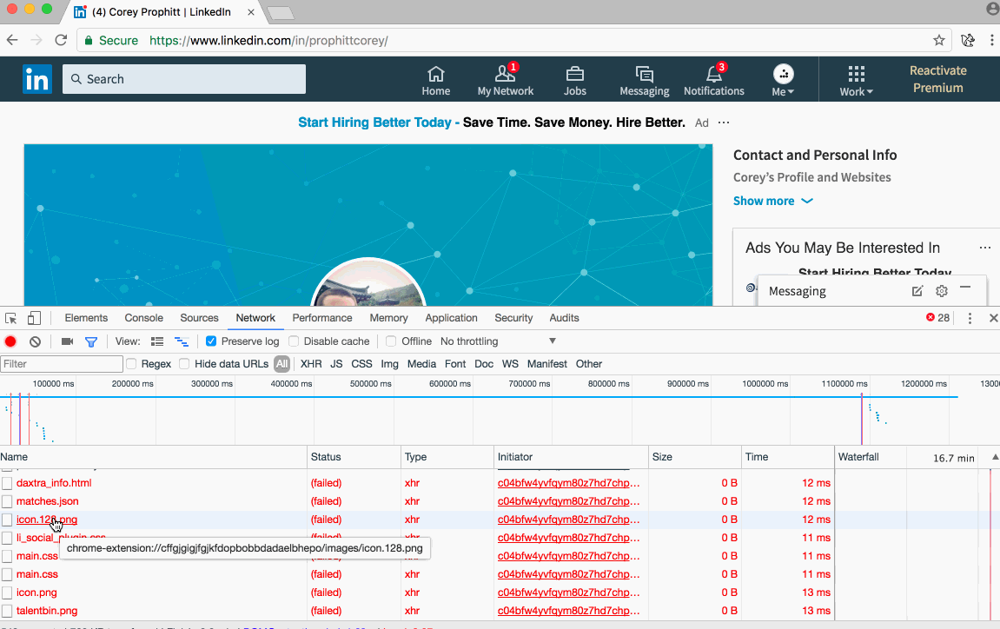

# Nefarious LinkedIn 

LinkedIn has been caught using dark patterns in the past. However, there's a dark
pattern being used by LinkedIn today no one talks about. LinkedIn currently spies
on their own users. In particular, LinkedIn wants to know which browser extensions
you use and may even ban your account for using them.

I'll dive into how LinkedIn detects extensions, and which extensions they are 
currently targetting. I have even built a simple browser extension to expose 
which extensions LinkedIn is scanning you for as well!


### Installation 

You can click [here](https://chrome.google.com/webstore/detail/nefarious-linkedin/mpkhbmjfapljfhjopagghpfgbmghjpah)
to install the extension via the Google web store, or you can download the 
[extension](./extension) folder in this repository and load it via Chrome's 
`chrome://extensions` page.

### How?

There are currently two common ways to detect a browser extension. The first of
which is by scanning public resources available in the extension, the other is
by analyzing the web page for extension-specific behavior. 

LinkedIn is currently using _both_ of these methods. 

###### Public Resources

If you ever browse LinkedIn with your developer console open you may have noticed
a slew of web request errors. If you give them a closer look you can see something
rather suspicious. The web requests LinkedIn makes are not over the web, rather, 
they are making requests to your local browser extensions!

Here's a screenshot that shows just that: 



They are making a bunch of requests to local extensions (`chrome-extension://`)
URLs. If you had any of the extensions installed and the resource is publicly 
available the web request wouldn't fail (and LinkedIn would know you are using
the extension). 

###### Behavioral Patterns

The second way to detect an extension is by looking at the web page and try to
identify changes to the web page caused by well known extensions. This can be
error prone and can be forged by other extensions. It appears LinkedIn uses this
method as well. 

LinkedIn stores (and tries to obfuscate) a file on your system that contains 
which patterns to search for a given extension. The file itself is located in
the local storage of your browser under the key `C_C_M`. If you look at the 
contents of the key, you'll see gibberish. The contents are base64 encoded. 

Once decoded the contents are further obfuscated. It's clearly a JSON document 
but the characters are all encoded in a way which makes reading it as a human 
difficult. If you parse the JSON you can retrieve a human friendly object to
examine!

Try it yourself, visit a LinkedIn page, open the inspector and run:

```javascript 
JSON.parse(window.atob(localStorage.getItem('C_C_M')))
```

You can see the output here: 


Notice the `selector` attribute in the JSON? It's clear they are searching for 
an element with the id `#daxtra-info-div`. 

If you examine the path list in the JSON you can see which public resources they
are looking for. In this case: `ombdgbngokkngdbcahjbeimfcfimdole/magnet/ChromePlugin/inject/daxtra_info.html`

Clearly, they are trying to identify users with the 
[Daxtra](https://chrome.google.com/webstore/detail/daxtra-magnet/ombdgbngokkngdbcahjbeimfcfimdole?hl=en) 
extension installed.

Funnily enough they try to obfuscate the name of each extension. If you look at
the name in the screenshot you can see, `wOmysO` which maps to `Daxtra`. It's 
clearly a simple substitution cipher of some kind. 

I've gone ahead and broke most of the cipher and that is how the extension is 
able to show you the names of each extension they are looking for.

### Credit 

The squirrel icon used by the extension was found on 
[Flaticon](http://www.flaticon.com/) and is credited to Freepik. 
